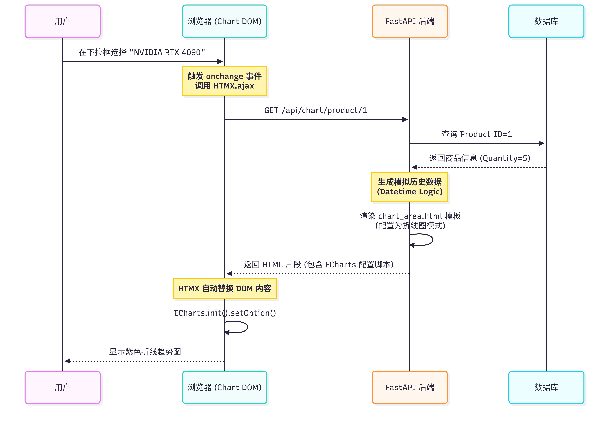
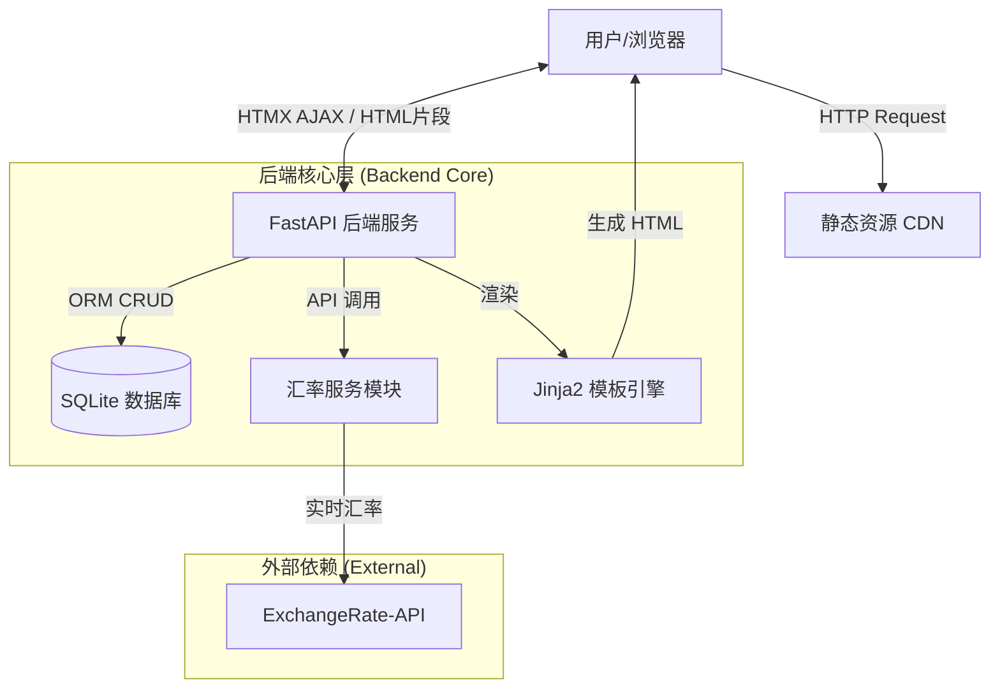
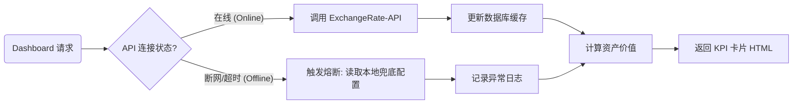

# 🌍 GlobalTrade Monitor | 跨境电商智能库存与汇率监控看板


> **2025年冬季学期《商业应用程序开发》期末大作业**
>
> **项目状态**：✅ 已完成核心开发 | 🚀 生产就绪

## 📖 项目简介 (Introduction)

在跨境电商业务中，卖家常面临**多币种进货、单币种核算**的难题。汇率的剧烈波动会直接压缩利润空间，而传统的 ERP 系统往往缺乏实时的资产重估能力。

**GlobalTrade Monitor** 是一款基于 **FastAPI + HTMX** 的现代化商业智能（BI）看板。它集成了实时汇率接口，能够对分布在全球（USD/EUR/JPY/GBP）的库存资产进行秒级折算，并提供**汇率-利润敏感度分析**，帮助经营者在汇率波动中锁定利润，做出精准的补货与结汇决策。


## ✨ 核心功能 (Key Features)

### 1. 🌐 全球化运营驾驶舱 (Cockpit)
*   **多语言国际化 (i18n)**：支持 **中文 / English** 一键无缝切换，覆盖侧边栏、图表及系统提示。
*   **沉浸式 UI 设计**：采用 **Glassmorphism (毛玻璃)** 视觉风格，配合股市风格的顶部 Ticker 滚动条，营造专业金融终端体验。
*   **智能交互**：
    *   右上角 KPI 卡片支持 **ECharts 可视化模态框** 下钻分析。
    *   内置 **AI 智能咨询** 模块，模拟生成市场风险报告。

### 2. 📊 高级数据分析
*   **双模式图表**：支持在“利润敏感度（折线图）”与“资金分布（饼图）”之间平滑切换。
*   **真实商业模拟**：
    *   内置 **Upsert 逻辑** 的数据生成器，模拟真实的市场交易（库存消减、价格波动），而非单纯的数据堆叠。
    *   **汇率-利润剪刀差**：直观展示汇率波动对净利润的挤压效应。

### 3. 🛡 企业级系统管理
*   **数据灾备**：提供 SQLite 数据库的 **快照下载 (Backup)** 与 **文件恢复 (Restore)** 功能。
*   **团队权限**：可视化的成员管理界面，支持模拟邀请与权限分配。
*   **高可用架构**：后端集成熔断机制，外部汇率 API 断连时自动降级至本地缓存。

---

## 🛠 技术架构 (Technical Architecture)

本项目采用 **Server-Driven UI (服务端驱动 UI)** 架构，摒弃了繁重的前端构建流程，实现了极致的开发效率与页面加载速度。

### 1. 交互时序图


### 2. 数据库设计


### 3. 技术栈一览

| 模块 | 技术选型 | 说明 |
| :--- | :--- | :--- |
| **后端框架** | **FastAPI** | 高性能异步 Python 框架，负责业务逻辑与 API 路由。 |
| **数据库** | **SQLite + SQLModel** | 轻量级关系型数据库，配合 ORM 进行数据操作。 |
| **前端交互** | **HTMX** | **核心亮点**。通过 HTML 属性实现 AJAX 局部刷新，无 React/Vue 复杂度。 |
| **前端状态** | **Alpine.js** | 处理模态框、Tab 切换、折叠菜单等轻量级 DOM 交互。 |
| **UI 设计** | **Tailwind CSS** | 原子化 CSS 框架，构建现代、响应式的 SaaS 界面。 |
| **数据可视化** | **Apache ECharts** | 商业级图表库，实现动态折线图、双轴图、饼图。 |

### 4. 系统架构图



### 5. 核心业务流程：汇率兜底机制



---

## 💻 快速开始 (Quick Start)

### 1. 环境准备
确保已安装 Python 3.9+。

### 2. 安装依赖
```bash
pip install -r requirements.txt
```

### 3. 配置 (可选)
项目默认内置了 API 熔断机制。如需使用真实实时数据：
*   打开 `services.py`。
*   替换 `API_KEY` 为您的 ExchangeRate-API 密钥。

### 4. 启动应用
在项目根目录下运行：
```bash
# 开发模式 (推荐)
uvicorn main:app --reload

# 局域网共享模式 (让队友也能访问)
uvicorn main:app --host 0.0.0.0 --port 8000
```

### 5. 访问系统
打开浏览器访问：[http://127.0.0.1:8000](http://127.0.0.1:8000)

## 📂 项目目录说明

```text
GlobalTradeMonitor/
├── main.py              # 核心控制器：路由、业务逻辑聚合、多语言配置
├── models.py            # 数据模型：定义 User, Product, ExchangeRate 表结构
├── services.py          # 服务层：处理汇率 API 调用与兜底策略
├── database.py          # 基础设施：数据库连接与初始化
├── trade_monitor.db     # 数据文件 (自动生成)
├── static/              # 静态资源 (favicon 等)
├── templates/           # 视图层 (Jinja2 模板)
│   ├── base.html        # 基础布局 (侧边栏、顶部栏、全局样式)
│   ├── dashboard.html   # 核心仪表盘 (Tab 切换、图表容器、AI模块)
│   ├── inventory.html   # 库存管理 (表格、Modal、CSV导入)
│   ├── settings.html    # 系统设置 (账号、备份)
│   └── partials/        # HTMX 局部组件
│       ├── stats_cards.html  # 汇率 Widget 与 KPI
│       ├── chart_area.html   # 库存深度图表模板
│       ├── chart_profit.html # 利润分析图表模板
│       └── chart_pie.html    # 资金分布图表模板
└── README.md            # 项目说明文档
```

---

## 📄 版权说明
本应用仅供**《商业应用程序开发》**课程作业展示使用。
