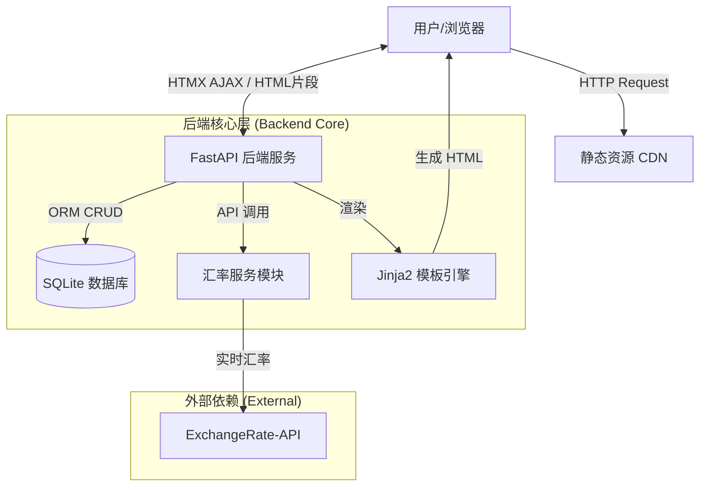
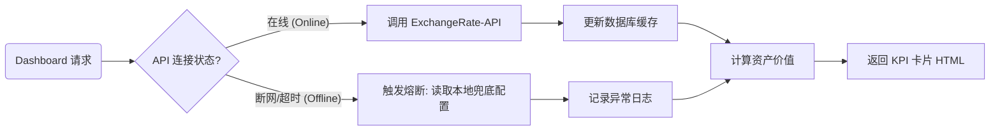

# 🌍 GlobalTrade Monitor | 跨境电商智能库存与汇率监控看板


> **2025年冬季学期《商业应用程序开发》期末大作业**
>
> **项目状态**：✅ 已完成核心开发 | 🚀 生产就绪

## 📖 项目简介 (Introduction)

在跨境电商业务中，卖家常面临**多币种进货、单币种核算**的难题。汇率的剧烈波动会直接压缩利润空间，而传统的 ERP 系统往往缺乏实时的资产重估能力。

**GlobalTrade Monitor** 是一款基于 **FastAPI + HTMX** 的现代化商业智能（BI）看板。它集成了实时汇率接口，能够对分布在全球（USD/EUR/JPY/GBP）的库存资产进行秒级折算，并提供**汇率-利润敏感度分析**，帮助经营者在汇率波动中锁定利润，做出精准的补货与结汇决策。

---

## ✨ 核心功能 (Key Features)

### 1. 🚀 运营驾驶舱 (Dashboard)
*   **全球资产秒级重估**：集成 ExchangeRate-API，每 30 秒自动刷新全盘库存的 CNY 价值。
*   **智能汇率 Widget**：支持“单币种焦点”与“全网格全览”两种视图，内置 Alpine.js 折叠交互，节省屏幕空间。
*   **多维数据可视化**：
    *   **库存深度透视**：支持查看 Top 15 商品总览，或下钻至单品查看 7 天库存模拟趋势。
    *   **利润敏感度分析**：双轴图表展示“汇率波动指数”与“预估利润率”的反向剪刀差关系。
    *   **资金分布**：直观展示不同外币资产的占比。

### 2. 📦 智能库存管理
*   **多币种混合录入**：支持 USD, EUR, JPY, GBP 等多种货币商品的增删改查。
*   **演示神器**：内置“一键生成模拟数据”功能，瞬间填充高仿真商业数据。
*   **批量导入**：支持标准 CSV 文件上传，实现数据批量初始化。

### 3. 🛡 系统设置与安全
*   **数据安全**：提供 SQLite 数据库的**一键备份（下载）**与**一键还原（上传）**功能。
*   **账号管理**：基于 HTMX 的成员管理系统，支持管理员的增删操作。
*   **高可用架构**：内置**熔断兜底机制**，即使外部 API 断网，系统自动切换至本地预设汇率，确保演示不中断。

---

## 🛠 技术架构 (Technical Architecture)

本项目采用 **Server-Driven UI (服务端驱动 UI)** 架构，摒弃了繁重的前端构建流程，实现了极致的开发效率与页面加载速度。

### 1. 技术栈一览

| 模块 | 技术选型 | 说明 |
| :--- | :--- | :--- |
| **后端框架** | **FastAPI** | 高性能异步 Python 框架，负责业务逻辑与 API 路由。 |
| **数据库** | **SQLite + SQLModel** | 轻量级关系型数据库，配合 ORM 进行数据操作。 |
| **前端交互** | **HTMX** | **核心亮点**。通过 HTML 属性实现 AJAX 局部刷新，无 React/Vue 复杂度。 |
| **前端状态** | **Alpine.js** | 处理模态框、Tab 切换、折叠菜单等轻量级 DOM 交互。 |
| **UI 设计** | **Tailwind CSS** | 原子化 CSS 框架，构建现代、响应式的 SaaS 界面。 |
| **数据可视化** | **Apache ECharts** | 商业级图表库，实现动态折线图、双轴图、饼图。 |

### 2. 系统架构图



### 3. 核心业务流程：汇率兜底机制



---

## 💻 快速开始 (Quick Start)

### 1. 环境准备
确保已安装 Python 3.9+。

### 2. 安装依赖
```bash
pip install -r requirements.txt
```

### 3. 启动应用
在项目根目录下运行：
```bash
# 开发模式 (推荐)
uvicorn main:app --reload

# 局域网共享模式 (让队友也能访问)
uvicorn main:app --host 0.0.0.0 --port 8000
```

### 4. 访问系统
打开浏览器访问：[http://127.0.0.1:8000](http://127.0.0.1:8000)

---

## 📂 项目目录说明

```text
GlobalTradeMonitor/
├── main.py              # 核心控制器：路由、业务逻辑聚合
├── models.py            # 数据模型：定义 User, Product, ExchangeRate 表结构
├── services.py          # 服务层：处理汇率 API 调用与兜底策略
├── database.py          # 基础设施：数据库连接与初始化
├── trade_monitor.db     # 数据文件 (自动生成)
├── static/              # 静态资源 (favicon 等)
├── templates/           # 视图层 (Jinja2 模板)
│   ├── base.html        # 基础布局 (侧边栏、顶部栏)
│   ├── dashboard.html   # 核心仪表盘 (Tab 切换、图表容器)
│   ├── inventory.html   # 库存管理 (表格、Modal、CSV导入)
│   ├── settings.html    # 系统设置 (账号、备份)
│   └── partials/        # HTMX 局部组件
│       ├── stats_cards.html  # 汇率 Widget 与 KPI
│       ├── chart_area.html   # 库存深度图表模板
│       ├── chart_profit.html # 利润分析图表模板
│       └── chart_pie.html    # 资金分布图表模板
└── README.md            # 项目说明文档
```

---

## 👥 团队分工 (Team Composition)

本项目采用**敏捷开发 (Agile)** 模式，团队 5 人分工明确，覆盖了全栈开发、质量保证与产品交付的全流程。

| 成员 | 角色 (Role) | 主要职责 (Responsibilities) |
| :--- | :--- | :--- |
| **[LWX]** | **技术负责人 (Tech Lead)**<br>**系统架构师** | • **核心架构**：搭建 FastAPI + HTMX + SQLModel 整体技术框架。<br>• **后端逻辑**：编写汇率同步 API、利润敏感度算法、熔断兜底机制。<br>• **数据可视化**：封装 ECharts 动态渲染接口，解决前后端数据流转问题。 |
| **[CZW]** | **前端工程师**<br>(Frontend Dev) | • **UI/UX 实现**：基于 Tailwind CSS 实现 Dashboard 响应式布局与美化。<br>• **交互逻辑**：编写 Alpine.js 脚本，实现侧边栏、模态框及 Tab 切换动画。<br>• **视图层开发**：协助将后端数据绑定至 Jinja2 模板。 |
| **[LMY]** | **测试工程师 (QA)**<br>**& 数据管理** | • **数据工程**：负责 CSV 批量导入/导出功能的验证，编写高仿真商业模拟数据。<br>• **系统测试**：执行功能测试（Function Testing），排查前端渲染与接口响应 Bug。<br>• **环境部署**：验证项目在不同环境下的运行稳定性。 |
| **[LZB]** | **产品经理 (PM)**<br>**& 业务分析** | • **商业逻辑**：梳理跨境电商“多币种核算”痛点，设计“汇率-利润”反向关联模型。<br>• **需求定义**：规划 Dashboard 的信息层级（KPI -> 图表 -> 列表）。<br>• **用户体验**：设计系统操作流程，确保符合商业软件规范。 |
| **[WSC]** | **文档工程师**<br>**& 演示汇报** | • **工程文档**：撰写 README 技术文档、API 接口说明及架构图绘制。<br>• **交付物制作**：编写用户操作手册，制作项目汇报 PPT。<br>• **演讲展示**：负责最终成果演示与讲解。 |

---

## 📄 版权说明
本应用仅供**《商业应用程序开发》**课程作业展示使用。
MIT License.
