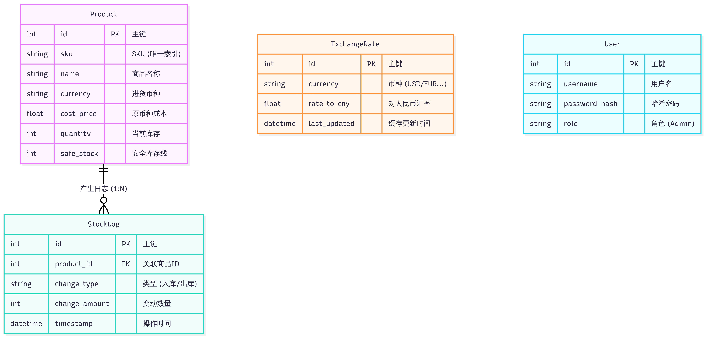
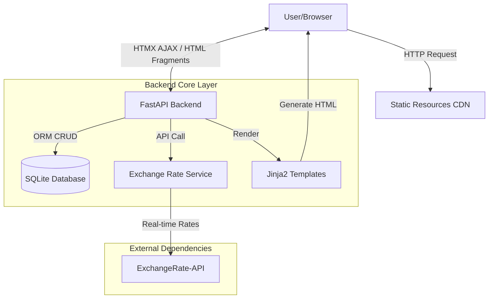
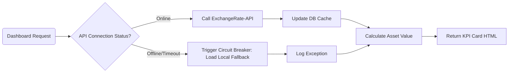

# 🌍 GlobalTrade Monitor | Cross-Border E-commerce Smart Inventory & Exchange Rate Dashboard
[](README.md)


> **Winter Semester 2025 "Business Application Development" Final Project**
>
> **Project Status**: ✅ Core Development Completed | 🚀 Ready for Production

## 📖 Introduction

In cross-border e-commerce, sellers often face the challenge of **multi-currency purchasing and single-currency accounting**. Drastic exchange rate fluctuations can directly compress profit margins, while traditional ERP systems often lack real-time asset revaluation capabilities.

**GlobalTrade Monitor** is a modern Business Intelligence (BI) dashboard based on **FastAPI + HTMX**. It integrates real-time exchange rate APIs to revalue inventory assets distributed globally (USD/EUR/JPY/GBP) into the base currency in seconds. It also provides **Exchange Rate-Profit Sensitivity Analysis**, helping operators lock in profits amidst fluctuations and make precise restocking and foreign exchange settlement decisions.

## ✨ Key Features

### 1. 🌐 Global Operations Cockpit
*   **Internationalization (i18n)**: Seamless **Chinese / English** switching, covering the sidebar, charts, and system notifications.
*   **Immersive UI Design**: Adopts a **Glassmorphism** visual style combined with a stock-market-style top ticker, creating a professional financial terminal experience.
*   **Smart Interaction**:
    *   Top-right KPI cards support **ECharts Visualization Modals** for drill-down analysis.
    *   Built-in **AI Smart Consultant** module simulating market risk report generation.

### 2. 📊 Advanced Data Analysis
*   **Dual-Mode Charts**: Smooth switching between "Profit Sensitivity (Line Chart)" and "Fund Distribution (Pie Chart)".
*   **Realistic Business Simulation**:
    *   Built-in data generator with **Upsert Logic**, simulating real market transactions (stock reduction, price fluctuation) rather than simple data stacking.
    *   **Rate-Profit Scissors Gap**: Intuitively visualizes the squeezing effect of exchange rate fluctuations on net profit.

### 3. 🛡 Enterprise System Management
*   **Disaster Recovery**: Provides SQLite database **Snapshot Download (Backup)** and **File Restoration (Restore)** functions.
*   **Team Permissions**: Visual member management interface supporting simulated invitations and permission assignment.
*   **High Availability Architecture**: Backend integrated with a **Circuit Breaker** mechanism; automatically degrades to local cached rates if the external API disconnects.

---

## 🛠 Technical Architecture

This project adopts a **Server-Driven UI (SDUI)** architecture, abandoning heavy frontend build processes to achieve extreme development efficiency and page load speed.

### 1. Interaction Sequence Diagram


### 2. Database Design


### 3. Tech Stack Overview

| Module | Technology | Description |
| :--- | :--- | :--- |
| **Backend Framework** | **FastAPI** | High-performance async Python framework for business logic and API routing. |
| **Database** | **SQLite + SQLModel** | Lightweight relational database with ORM for data operations. |
| **Frontend Interaction** | **HTMX** | **Core Highlight**. Achieves AJAX partial refreshing via HTML attributes, removing React/Vue complexity. |
| **Frontend State** | **Alpine.js** | Handles lightweight DOM interactions like modals, tabs, and collapsible menus. |
| **UI Design** | **Tailwind CSS** | Utility-first CSS framework for building modern, responsive SaaS interfaces. |
| **Data Visualization** | **Apache ECharts** | Commercial-grade chart library implementing dynamic line, dual-axis, and pie charts. |

### 4. System Architecture Diagram



### 5. Core Workflow: Exchange Rate Circuit Breaker



---

## 💻 Quick Start

### 1. Prerequisites
Ensure Python 3.9+ is installed.

### 2. Install Dependencies
```bash
pip install -r requirements.txt
```

### 3. Configuration (Optional)
The project has a built-in API circuit breaker. To use real-time data:
*   Open `services.py`.
*   Replace `API_KEY` with your own key from ExchangeRate-API.

### 4. Run the Application
Run the following command in the project root directory:
```bash
# Development Mode (Recommended)
uvicorn main:app --reload

# LAN Sharing Mode (Accessible by teammates)
uvicorn main:app --host 0.0.0.0 --port 8000
```

### 5. Access the System
Open your browser and visit: [http://127.0.0.1:8000](http://127.0.0.1:8000)

---

## 📂 Directory Structure

```text
GlobalTradeMonitor/
├── main.py              # Core Controller: Routing, business logic aggregation, i18n config
├── models.py            # Data Models: Definitions for User, Product, ExchangeRate tables
├── services.py          # Service Layer: Exchange rate API calls and circuit breaker logic
├── database.py          # Infrastructure: Database connection and initialization
├── trade_monitor.db     # Data File (Auto-generated)
├── static/              # Static Resources (favicon, etc.)
├── templates/           # View Layer (Jinja2 Templates)
│   ├── base.html        # Base Layout (Sidebar, Topbar, Global Styles)
│   ├── dashboard.html   # Core Dashboard (Tab switching, Chart containers, AI module)
│   ├── inventory.html   # Inventory Management (Tables, Modals, CSV Import)
│   ├── settings.html    # System Settings (Account, Backup)
│   └── partials/        # HTMX Partial Components
│       ├── stats_cards.html  # Rate Widget & KPI Cards
│       ├── chart_area.html   # Inventory Depth Chart Template
│       ├── chart_profit.html # Profit Analysis Chart Template
│       └── chart_pie.html    # Fund Distribution Chart Template
└── README.md            # Project Documentation
```

---

## 📄 License
This application is for demonstration purposes for the **"Business Application Development"** course only.
